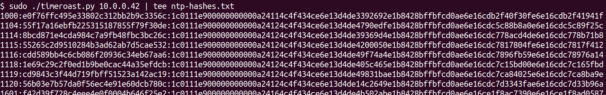
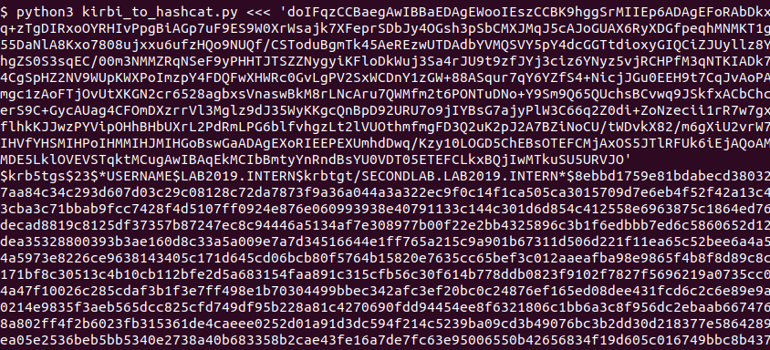

Timeroast and Trustroast scripts
================================

Python scripts accompanying the whitepaper [Timeroasting, trustroasting and computer spraying: taking advantage of weak computer and trust account passwords in Active Directory](https://www.secura.com/uploads/whitepapers/Secura-WP-Timeroasting-v3.pdf). These support the _timeroasting_ and _trustroasting_ attack techniques by discovering weak computer or trust passwords within an Active Directory domain.

How to run
----------

Both scripts require Python 3.6 or higher. No installation is required. The Timeroasting scripts have no further 
dependencies and the Trustroast scripts solely depends on [Impacket](https://github.com/fortra/impacket).

Run each script with `-h` for usage instructions.

Timeroasting
------------

Timeroasting takes advantage of Windows' NTP authentication mechanism, allowing unauthenticated attackers to effectively request a password hash of any computer account by sending an NTP request with that account's RID. This is not a problem when computer accounts are properly generated, but if a non-standard or legacy default password is set this tool allows you to brute-force those offline.

Two scripts are included:

- `timeroast.py`: given a DC domain name or IP, will attempt to get 'NTP hashes' of the computer accounts in the domain by enumerating RID's. Requires root privileges in order to be able to receive NTP responses.
- `timecrack.py`: performs a simple, unoptimized, dictionary attack on the results of `timeroast.py`. 

Hashcat [will add support for Timeroasting hashes](https://github.com/hashcat/hashcat/issues/3629) as hash type 31300. Currently, it's already available in the (beta release)[https://hashcat.net/beta/].

Trustroasting
-------------

I currently have not implemented a convenient `trustroast.py` script that will automatically enumerate trusts and fetch tickets. However, this can easily be achieved with [Rubeus](https://github.com/GhostPack/Rubeus) in the way described in the whitepaper. I did add a simple script which converts Rubeus' output format into something you can slot into Hashcat:

- `kirbi_to_hashcat.py`: converts a Kerberos ticket (referal/trust, service, ticket-granting, etc.) that is encoded as a base64 KRB_CRED structure into a Hashcat format. Hash types 13100, 19600, 19700 (i.e. RC-4 and AES tickets) are supported.
